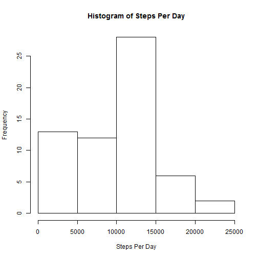
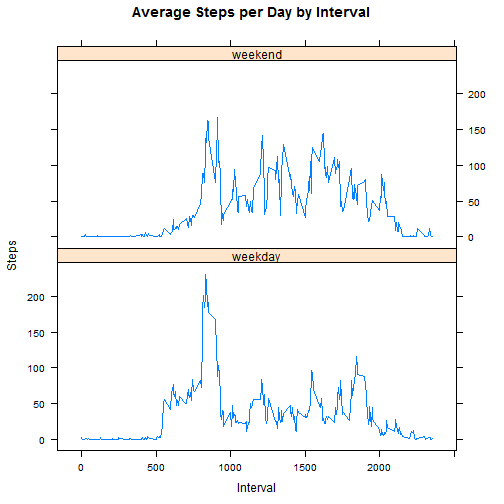

## Load knitr library and set echo=TRUE so others can read the code.

```r
library(knitr)
opts_chunk$set(echo = TRUE)
```

## Load the needed packages

```r
library(dplyr)
library(ggplot2)
```

## Loading and preprocessing the data
### Load the data (i.e. read.csv())

```r
activityData <- read.csv(file = "activity.csv", stringsAsFactors = FALSE)
```

## What is mean total number of steps taken per day?
### Calculate the total number of steps taken per day

```r
numberOfStepsPerDay <- tapply(activityData$steps, activityData$date, sum, na.rm=TRUE)
```

### Make a histogram of the total number of steps taken each day.

```r
hist(numberOfStepsPerDay, main = "Histogram of Steps Per Day", xlab = "Steps Per Day")
```



### Calculate and report the mean and median of the total number of steps taken per day.

```r
meanTotalStepsPerDay <- mean(numberOfStepsPerDay)
medianTotalStepsPerDay <- median(numberOfStepsPerDay)
```
Mean Total Number of Steps per Day : 9354.2295082
Median Total Number of Steps per Day : 10395


## What is the average daily activity pattern?

```r
avgStepsPerInterval <- aggregate(activityData$steps, list(activityData$interval), mean, na.rm=TRUE)
```

### Make a time series plot (i.e. type = "l") of the 5-minute interval (x-axis) and the average number of steps taken, averaged across all days (y-axis)

```r
plot(avgStepsPerInterval$Group.1,avgStepsPerInterval$x , type ="l", xlab = "Interval" , ylab = "Average Steps Per Interval")
```


### Which 5-minute interval, on average across all the days in the dataset, contains the maximum number of steps?

```r
maximumSteps <- max(avgStepsPerInterval$x)
intervalOfMaximumSteps <- avgStepsPerInterval[avgStepsPerInterval$x == maximumSteps,"Group.1"]/100
```
5-minute interval with maximum steps: 8.35


## Imputing missing values
### Calculate and report the total number of missing values in the dataset (i.e. the total number of rows with NAs)

```r
missingValues <- sum(is.na(activityData$steps))
```
Missing values: 2304
 
### Devise a strategy for filling in all of the missing values in the dataset.

```r
imputeSteps <- function(steps, interval) {
     imputevalue <- NA
     if (!is.na(steps))
         imputevalue <- steps
     else
         imputevalue <- (avgStepsPerInterval[avgStepsPerInterval$Group.1==interval, "x"])
     return(imputevalue)
 }
```
Missing values are imputed with average value of steps in a particular interval
 
### Create a new dataset that is equal to the original dataset but with the missing data filled in.

```r
activityImputed <- activityData
activityImputed$steps <- mapply(imputeSteps, activityImputed$steps, activityImputed$interval)
stepsPerDayImputed <- tapply(activityImputed$steps, activityImputed$date, sum)
```
 
### Make a histogram of the total number of steps taken each day and Calculate and report the mean and median total number of steps taken per day.

```r
hist(stepsPerDayImputed, main = "Histogram of Steps Per Day After Imputation", xlab = "Steps Per Day")
```


```r
meanStepsPerDayImputed <- mean(stepsPerDayImputed)
medianStepsPerDayImputed <- median(stepsPerDayImputed)
```
Mean Steps Per Day After Imputation : 1.0766189 &times; 10<sup>4</sup>
Median Steps Per Day After Imputation : 1.0766189 &times; 10<sup>4</sup>


## Differences in activity patterns between weekdays and weekends?
### Create a new factor variable in the dataset with two levels – “weekday” and “weekend” indicating whether a given date is a weekday or weekend day.

```r
identifyWeekday <- function(date) {
 dayofWeek <- weekdays(strptime(date,"%Y-%m-%d"))
  if (dayofWeek %in% c("Monday", "Tuesday", "Wednesday", "Thursday", "Friday")) 
    return("weekday") else  (dayofWeek %in% c("Saturday", "Sunday")) 
  return("weekend")
  }

activityImputed$day1 <- sapply(activityImputed$date, FUN = identifyWeekday)
meanSummary <- aggregate(steps ~ interval + day1, data = activityImputed, mean)
```
 
### Make a panel plot containing a time series plot (i.e. type = "l") of the 5-minute interval (x-axis) and the average number of steps taken, averaged across all weekday days or weekend days (y-axis).

```r
library(lattice)
xyplot(meanSummary$steps ~ meanSummary$interval|meanSummary$day, main="Average Steps per Day by Interval",xlab="Interval", ylab="Steps",layout=c(1,2), type="l")
```


